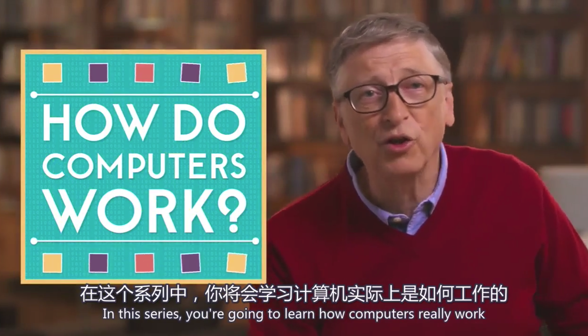
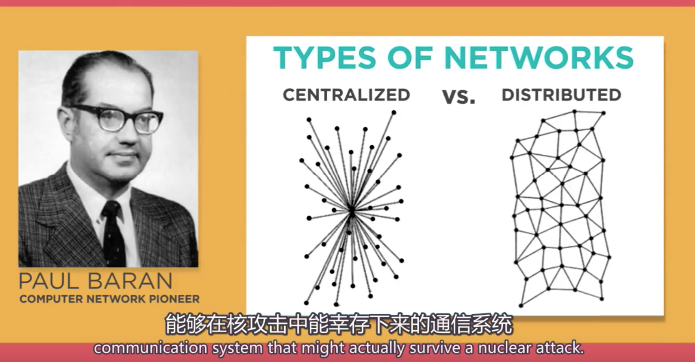
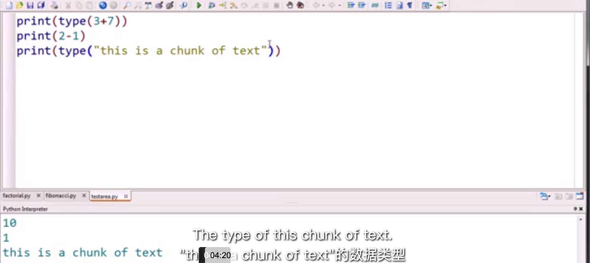
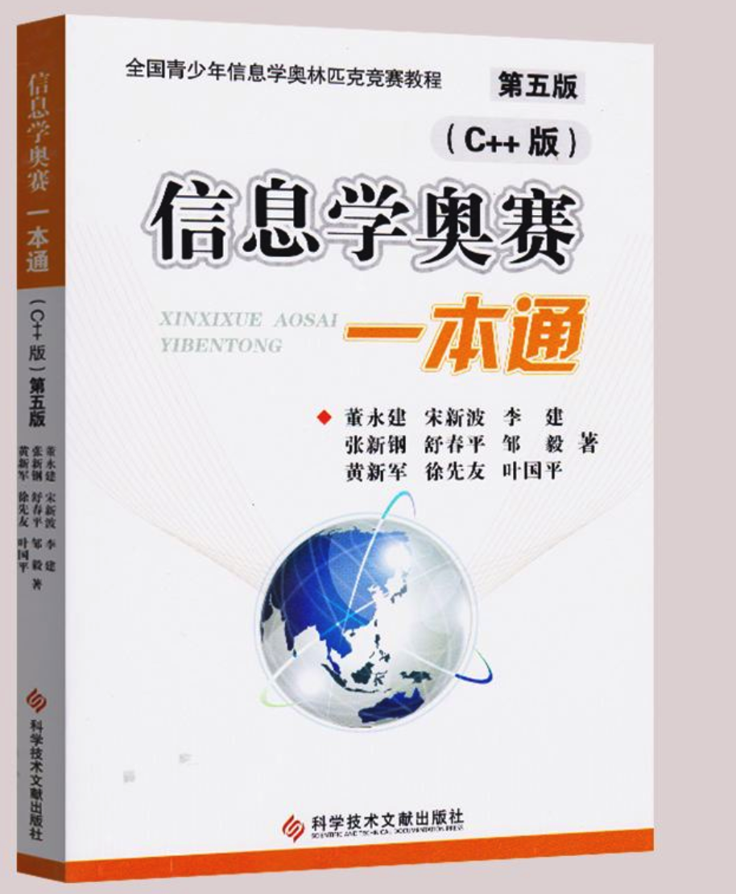

之前在做开发的时候，觉得将编程可视化，对于小孩儿来说应该是一个不错的教育，在做了一段时间教育后发现这类的教育机构如雨后春笋般出现在神州大地。具体各种机构就不一一例举了。
这里来说一下国内STEAM教育的体系以及来源。做一些东西，供各位家长学习参考，如果想给孩子报班，还是选择专业的机构，毕竟专业的人做专业的事。
[steam教育介绍](https://baike.baidu.com/item/steam/19757611)

### 小学阶段孩子可以先从[scratch](https://scratch.mit.edu/projects/editor/?tutorial=getStarted)开始。

> 目标：通过编程三种结构，建构起计算思维。

### 初中以后可以先看一些[计算机原理](http://ejzcode.com/computer_princeple/)、[计算机网络](http://ejzcode.com/computer_network/)、[python](http://open.163.com/newview/movie/free?pid=M8O9BOGDE&mid=M8OEETAR1)、[pygame](https://www.pygame.org/news)。

> 目标：了解计算机运行原理，培养由具象认识到抽象思维的过度，解构复杂事物背后的基本因素和建立第一性原理和演化思维方法。

### 高中学有余力，可以试着看看[信息学](http://ybt.ssoier.cn:8088/#)

> 目标：拓宽解决问题的思路，优化流程与效率。

没有找到更好的pygame课程，以后再更新吧。这些仅供参考，毕竟我不是儿童教育方面的工作人员，这些是个人的一些思考。

> **感谢以下网站：**
> [scratch](https://scratch.mit.edu/)
> [code.org](https://studio.code.org/home)
> [二进制学院](http://ejzcode.com/)
> [网易公开课](https://open.163.com/)

