之前一直在用一个国外翻墙软件，一直想自己搭建一个自己vps服务器用于写代码😃，偶尔一次看到可以使用这个视频，来学习下，怎么自己搭建SSR。
# SSR
[视频链接](https://www.youtube.com/watch?v=RxbGtkRVUWQ)
> ►谷歌云地址：
> https://cloud.google.com/
> ►Ping检测：
> http://ping.chinaz.com
> ►VPS连接软件（PuTTY）：
> https://www.lanzous.com/i68xjpg
> ►国外地址生成：
> https://www.dizhishengcheng.com/

## 1.注册谷歌云
SSH客户端登录设置：
* 输入：`vi /etc/ssh/sshd_config`
* 键盘输入 `i`，找到`PermitRootLogin no`，将`no`改为`yes`；
* 再找到`PasswordAuthenticaion no`，将`no`改为`yes`；
* 键盘按`Esc`，再输入 `:wq`
* 输入：`passwd`，设置密码（设置并确认）
* 输入：`systemctl restart sshd`

## 2.安装BBRPlus

更换内核需要root权限，所以如果你是普通用户的话，需要root账号权限，如果你是root账号，那就忽略这个步骤：

```
sudo -i
```
BBR一键安装代码：

```
wget --no-check-certificate https://raw.githubusercontent.com/cx9208/Linux-NetSpeed/master/tcp.sh && chmod +x tcp.sh && ./tcp.sh
```

若报错运行以下代码，不报错跳过：

```
yum -y install wget
rm -f /var/run/yum.pid
```
重新打开脚本，查看是否运行成功：

```
./tcp.sh
```
## 3.安装ShadowsocksR
简单的来说，如果你什么都不懂，那么你直接一路回车就可以了！

1、本脚本需要Linux root账户权限才能正常安装运行，所以如果不是 root账号，请先切换为root，如果是 root账号，那么请跳过！

```
sudo -i
```

2、ShadowsocksR服务端一键安装：

```
wget -N --no-check-certificate https://raw.githubusercontent.com/ToyoDAdoubiBackup/doubi/master/ssr.sh && chmod +x ssr.sh && bash ssr.sh
```

运行脚本，输入对应的数字来执行相应的命令。

```
bash ssr.sh
```


-------

# V2ray

## 搭建V2ray+ws+tls+nginx转发


前言
--

其实一键安装脚本安装毫无技术而言。开源的脚本，不存在什么后门。那些说有后面的人就别安装了。（开源的，人家弄个后门，没有这样的。。。。。）


在此感谢 wulabing_v2ray

**GitHub 项目地址：[点击访问](https://www.v2rayssr.com/go?url=https://github.com/wulabing/V2Ray_ws-tls_bash_onekey)**

**YouTube 视频观看地址：[点击访问](https://www.v2rayssr.com/go?url=https://youtu.be/rPC1cpFfCx4)**


### 2019-12-30 更新如下

> 本次更新内容较多，并存在部分代码重构及合并，请留意，建议用户使用新版管理脚本时 先执行卸载后 重新安装对应版本

*   新增 交互式菜单，重构为安装管理脚本，版本号初始化为 1.0，诸多功能合并
*   合并 h2 版合并至主版本并跟随更新，h2 版（旧版）停止维护
*   新增 变更 UUID ALTERID PORT TLS 版本选项
*   新增 V2ray 日志记录及查看
*   新增 4 合 1 bbr 锐速脚本引入，感谢 94ish.me
*   新增 卸载选项
*   新增 证书手动更新，原理与计划任务更新相同，证书有效期仅小于 30 天可更新，默认不启用强制更新

注意事项
----

推荐在纯净环境下使用本脚本，如果你是新手，请不要使用 Centos 系统。

在尝试本脚本确实可用之前，请不要将本程序应用于生产环境中。

该程序依赖 Nginx 实现相关功能，请使用 LNMP 或其他类似携带 Nginx 脚本安装过 Nginx 的用户特别留意，使用本脚本可能会导致无法预知的错误（未测试，若存在，后续版本可能会处理本问题）。

V2Ray 的部分功能依赖于系统时间，请确保您使用 V2RAY 程序的系统 UTC 时间误差在三分钟之内，时区无关。

本 bash 依赖于 V2ray 官方安装脚本 及 acme.sh 工作。

Centos 系统用户请预先在防火墙中放行程序相关端口（默认：80，443）

准备工作
----

### 准备好你的域名

申请地址：[https://freenom.com](https://www.v2rayssr.com/go?url=https://freenom.com) （若你是申请不了免费的，那么请移步下面）

收费申请地址：[https://www.namesilo.com](https://www.v2rayssr.com/go?url=https://www.namesilo.com/?rid=6254266mw)   (随便申请一个年付 0.99 / 美元的域名，支付宝支付)

解析好你的域名（指向 VPS IP），波仔推荐你使用二级域名（XXX.XXX.XXX）

若不懂二级域名为何物，请移步视频区：[点击观看](https://www.v2rayssr.com/go?url=https://youtu.be/SbRWnlqSatU)

### 安装好 curl、wget

```
yum -y install wget    ##ContOS Yum 安装 wget
apt-get install wget   ##Debian Ubuntu 安装 wget
```

```
apt-get update -y && apt-get install curl -y    ##Ubuntu/Debian 系统安装 Curl 方法
yum update -y && yum install curl -y            ##Centos 系统安装 Curl 方法
```

### 安装 / 更新方式（h2 和 ws 版本已合并）

Vmess+websocket+TLS+Nginx+Website

```
wget -N --no-check-certificate -q -O install.sh "https://raw.githubusercontent.com/wulabing/V2Ray_ws-tls_bash_onekey/master/install.sh" && chmod +x install.sh && bash install.sh
```

启动方式
----

```
systemctl start v2ray #启动 V2ray 
systemctl stop v2ray #停止 V2ray 
systemctl start nginx #启动 Nginx 
systemctl stop nginx #停止 Nginx
```

相关目录
----

```
伪装的 Web 目录：/home/wwwroot/3DCEList
V2ray 服务端配置：/etc/v2ray/config.json
Nginx 目录： /etc/nginx
证书文件: /data/v2ray.key 和 /data/v2ray.crt
```


## VPS解锁Netflix播放
前言
--

最近很多小伙伴们在群里问波仔，购买的 VPS 不能观看 NetFlix，问有没有什么办法。办法当然是有。更改你的 DNS 就可以了。前提是这个 DNS 支持 NetFlix 的播放。

当然，你若是有 VPS 可以观看 NetFlix，可以在这个 VPS 上面搭建 DNS 服务用来解锁其他的 VPS 的 NetFlix 服务。那这个我们今天就不说了，今天说的前提是，你没有 VPS 可以观看 NetFlix。

**若你是看不懂，请观看视频：[点击观看](https://www.v2rayssr.com/go?url=https://youtu.be/hZS2XlAEhH8)**


准备工作
----

VPS 一台（系统随意）

搭建好你想搭建的代理

注册流媒体 DNS 解锁服务：[点击注册](https://www.v2rayssr.com/go?url=https://steamsv.com/aff.php?aff=59)

开始你的表演
------

### 流媒体网站的操作

把你的代理开为全局模式，看看 VPS 的出口公网 IP 是多少，在流媒体解锁服务界面找到如下图：


看看你的 VPS 公网 IP 到底是多少，有的 VPS 出口 IP 不是你的 VPS IP。

然后点击授权 IP，绑定你的公网 IP。（绑定后需要等待生效，时间大概几分钟）

原则上有两种方式解锁
----------

### 第一种（不推荐）

直接在 VPS 上面复制网站为我们提供的一键安装脚本，如下图：


这样会直接更改你 VPS 的 DNS。波仔不是太推荐。但若是你实在没有办法使用第二种方式，那么你就这样办吧。

### 第二种（推荐）

今天用 V2RAY 配置的方式为大家讲解。若你是 SSR 服务，那么请查阅官方相应的脚本。原则上和今天的方式相似。

打开 VPS 目录 `/etc/v2ray` , 找到`config.json`

我们需要更改你的 V2RAY 配置，让奈飞（NetFlix）的流量经过已经解锁 NetFlix 服务的 DNS，其他的流量和以前一样。

我这边为大家提供一个范例配置（这个配置是 v2ray+ws+tls+nginx 转发的一个配置）

```
{
  "dns": {
        "servers": [
            {
                "address": "xxx.xxx.xxx.xxx",     //此处为官方为你提供的 DNS 地址
                "port": 53,
                "domains": [
                    "domain:netflix.com",
                    "domain:netflix.net",
                    "domain:nflximg.net",
                    "domain:nflxvideo.net",
                    "domain:nflxso.net",
                    "domain:nflxext.com"
                ]
            },
            "localhost"
        ]
    },
  "inbounds": [{
    "port": 28745,           //此处为你 V2ray 的配置端口，Nginx 会在本地监听这个端口进行转发
    "listen":"127.0.0.1",
    "protocol": "vmess",
    "settings": {
      "clients": [
        {
          "id": "xxx-xxx-xxx-xxx", //此处为安装时生成的 id
          "level": 1,
          "alterId": xx      //此处为安装时生成的 alterId
        }
      ]
    },
    "streamSettings": {
      "network": "ws",       //你的网络方式
      "wsSettings": {
        "path": "/xxxxxx"   //此处为路径,不要落下/
      }
    }
  }],
  "outbounds": [
        {
            "protocol": "freedom",
            "settings": {
                "domainStrategy": "UseIP"
            },
            "tag": "direct"
        },
        {
            "protocol": "blackhole",
            "settings": {
                "response": {
                    "type": "http"
                }
            },
            "tag": "blocked"
        }
    ],
  "routing": {
    "rules": [
      {
        "type": "field",
        "ip": ["geoip:private"],
        "outboundTag": "blocked"
      }
    ]
  }
}
```

修改配置完成以后，请重启你的 V2RAY 服务，或是重启 VPS

```
## 启动
systemctl start v2ray
## 停止
systemctl stop v2ray
## 重启
systemctl restart v2ray
## 开机自启
systemctl enable v2ray
```

其实第二种方法也可以做分流，让不同的视讯走不同的 DNS，代码如下：

```
"dns": {
        "servers": [
            {
                "address": "美国 DNS",
                "port": 53,
                "domains": [
                    "domain:netflix.com",
                    "domain:netflix.net",
                    "domain:nflximg.net",
                    "domain:nflxvideo.net",
                    "domain:nflxso.net",
                    "domain:nflxext.com"
                ]
            },
            {
                "address": "台湾 DNS",
                "port": 53,
                "domains": [
                    "domain:gamer2-cds.cdn.hinet.net",
                    "domain:gamer-cds.cdn.hinet.net",
                    "domain:gamer.com.tw",
                    "domain:i2.bahamut.com.tw",
                    "domain:app-measurement.com"
                ]
            },
            {
                "address": "香港 DNS",
                "port": 53,
                "domains": [
                    "domain:bilibili.com"
                ]
            },
            "localhost"
        ]
    },
```

这样就可以达到你视讯分流的一个效果。若你是没有看懂，请观看 YouTube 视频。

# Trojan
 用了一段是时间的SSR出现了TCP阻断，为了防止出现不能访问国外网站的事情，所以特意来搭建一下Trojan。视频教程还是来自[番茄Style](https://www.youtube.com/watch?v=hYfaaTdfB8s)。
## VPS
### 创建实例
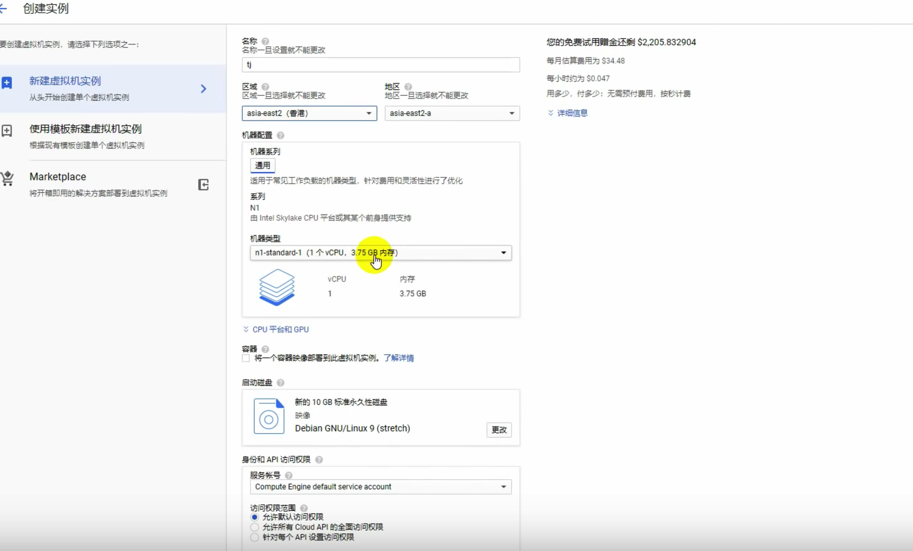
### 检测IP
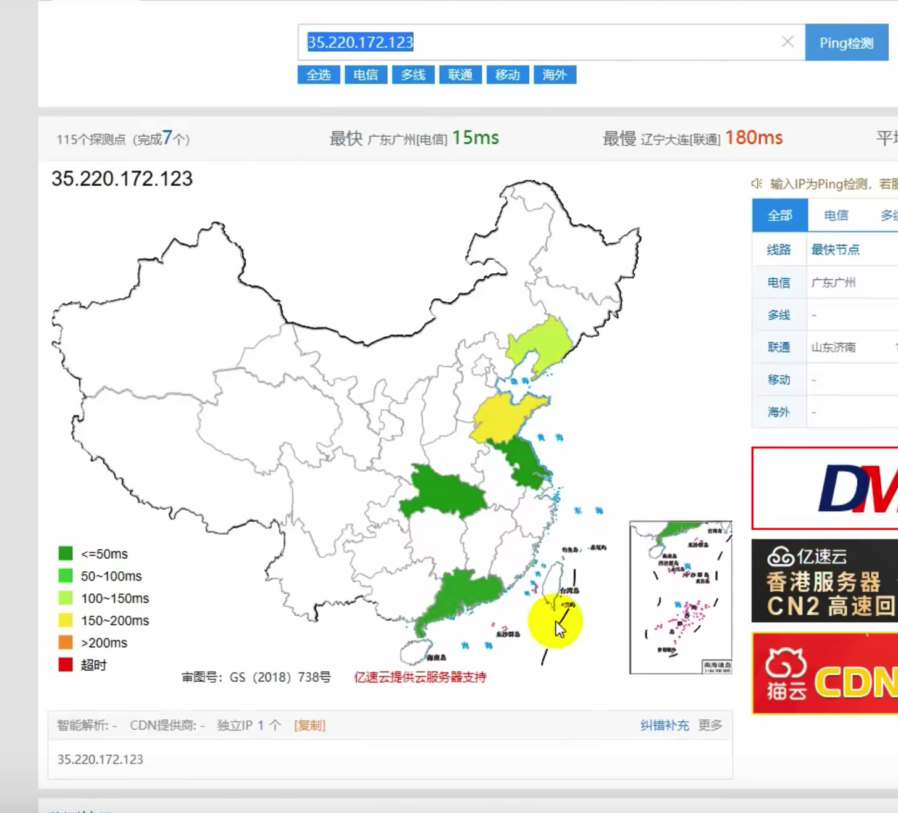
## 申请域名
### 购买域名
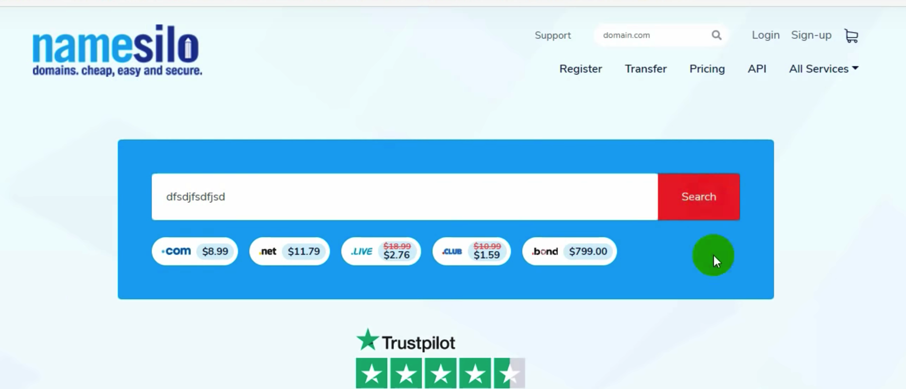
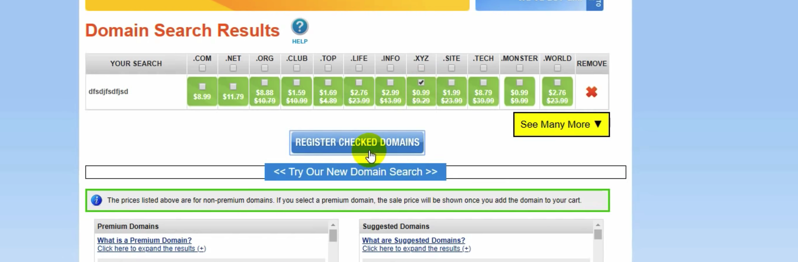
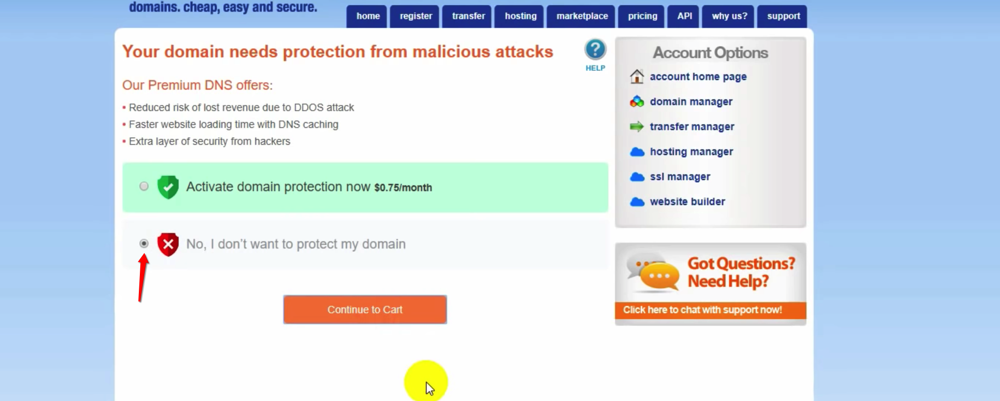
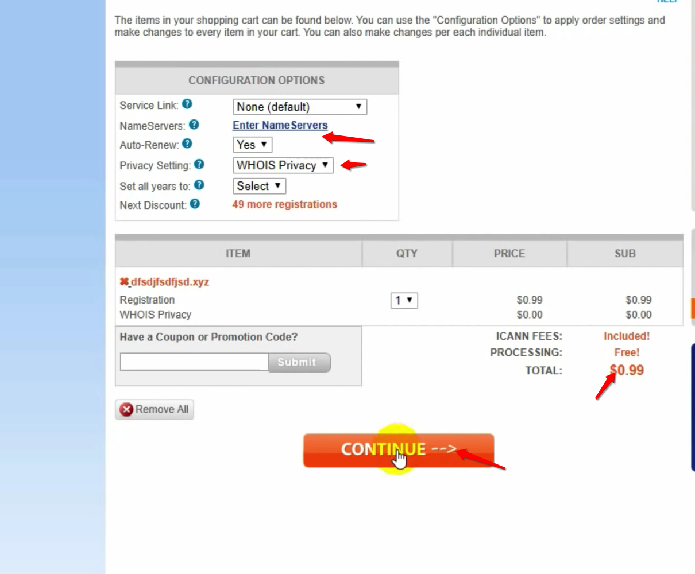

### 域名托管
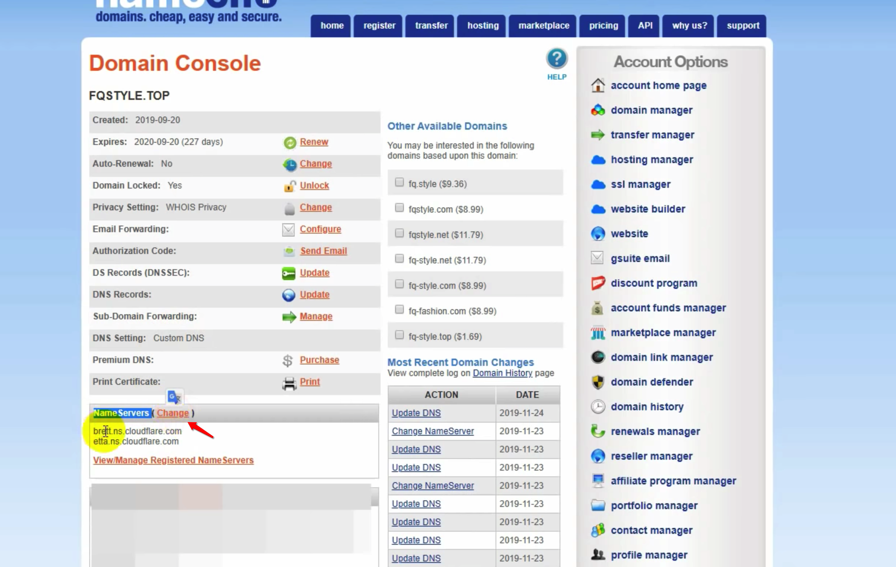
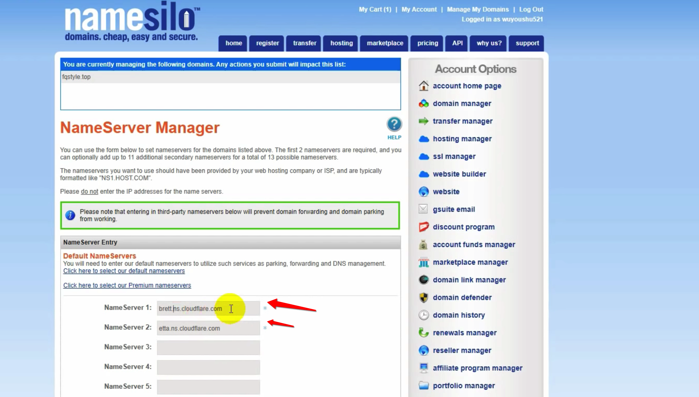
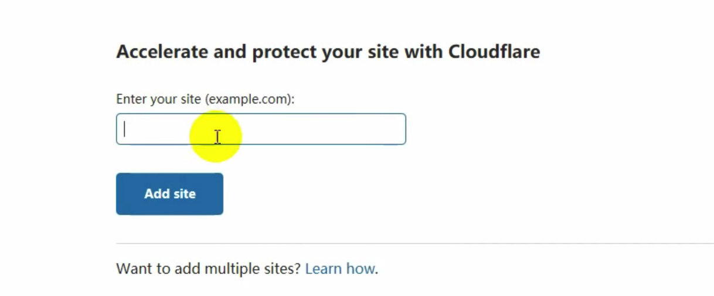
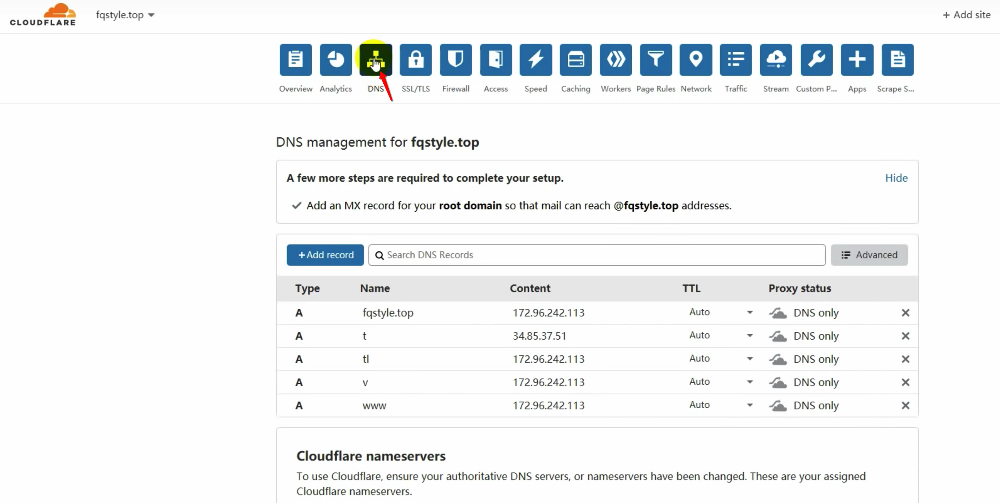
## 解析域名
### 域名解析
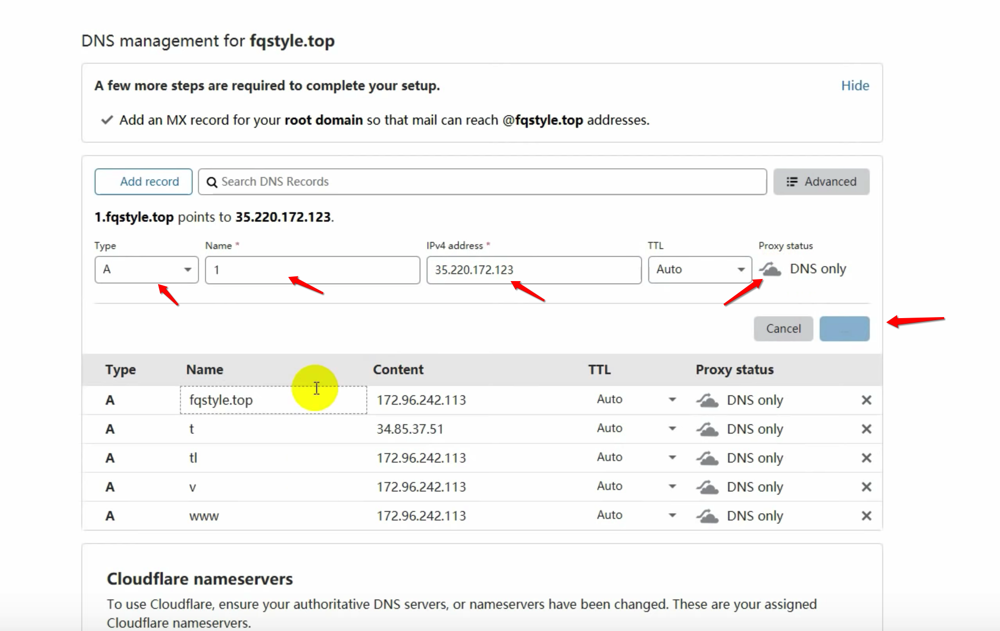
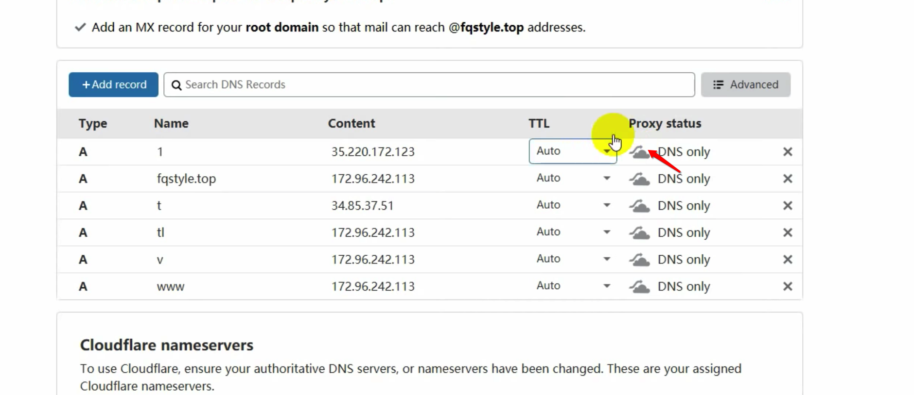
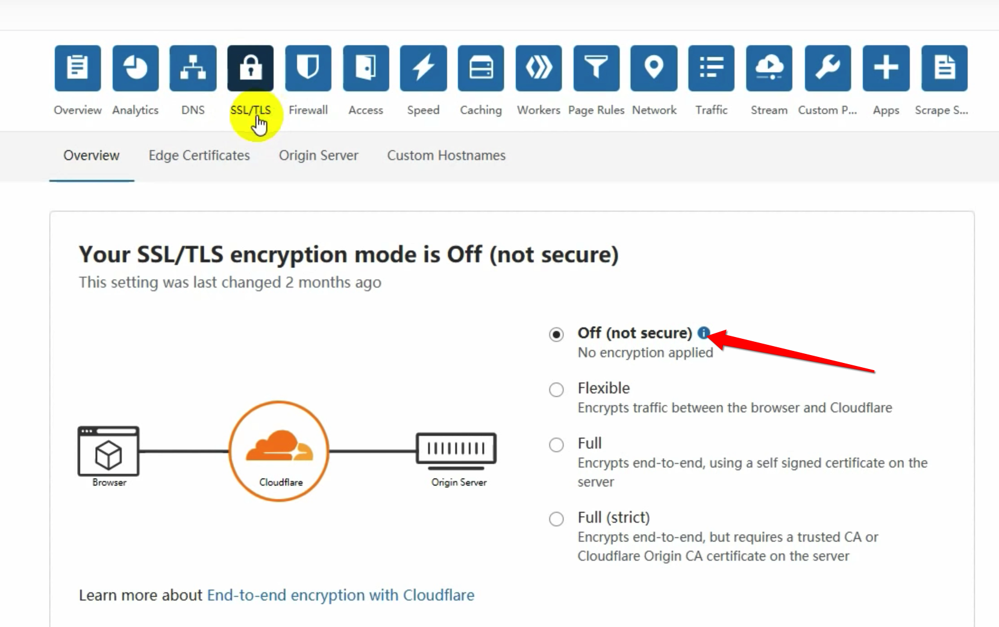
### 测试IP
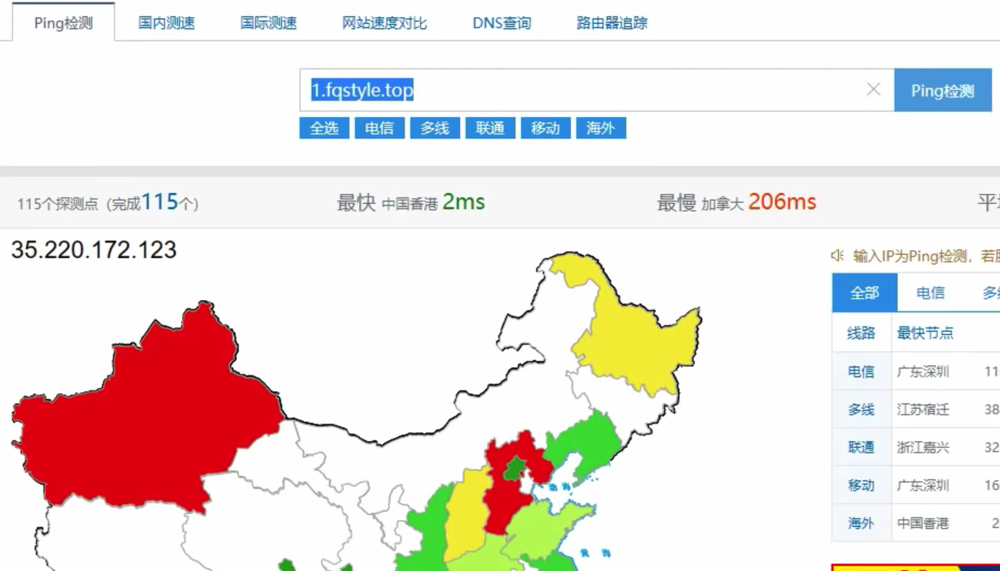
## 安装
### 进入BBRPlus
* 进入管理员：

```
sudo -i
```
* 查看当前目录的脚本：

```
root@ssr:~# ls
ssr.sh  tcp.sh  trojan_mult.sh

```

### 安装Trojan
* 复制以下命令在VPS中执行，选择安装trojan，然后输入解析到VPS的域名并回车（不要带http://，只输入域名，例如atrandys.com或者xxx.atrandys.com），开始安装，然后等待安装完成即可。

* 注意：如果提示SELinux状态问题，请按要求输入Y重启VPS，然后再执行本脚本，否则可能https证书申请出错


```
curl -O https://raw.githubusercontent.com/atrandys/trojan/master/trojan_mult.sh && chmod +x trojan_mult.sh && ./trojan_mult.sh

```
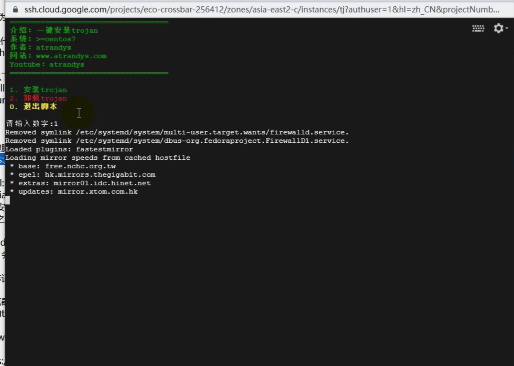
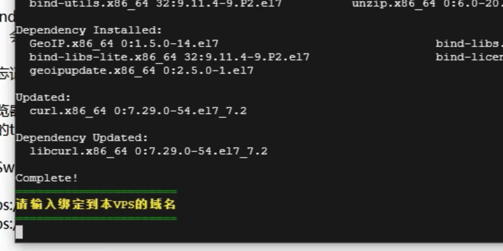
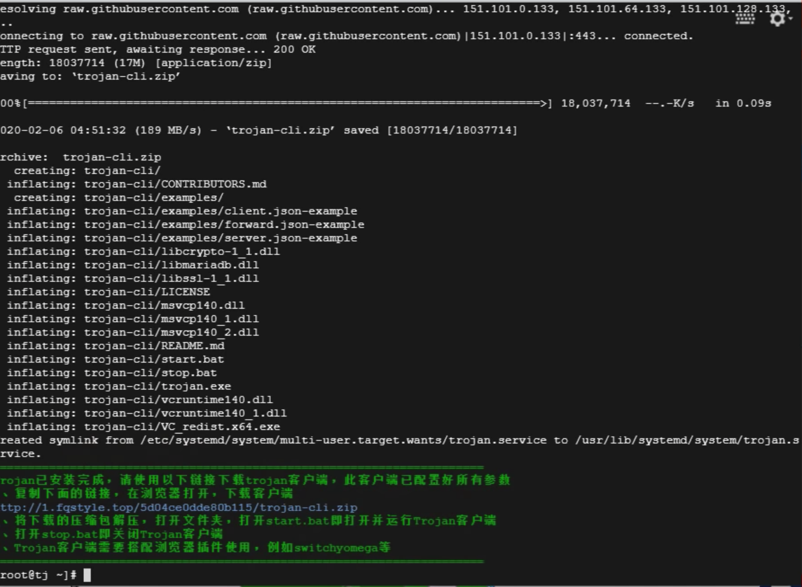

常用命令：

```
systemctl start trojan   #启动 Trojan
systemctl restart trojan  #重启 Trojan
systemctl enable trojan  #设置 Trojan 为开机自启
```

# 客户端设置
## Mac
Mac电脑下，可以通过终端工具和浏览器使用Trojan。
### Shadowsocket-NG
### V2rayU
### Trojan
* 插件
> 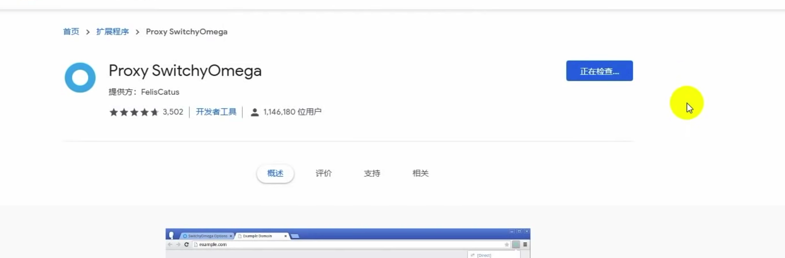
> [https://github.com/trojan-gfw/trojan/releases/tag/v1.14.1](https://github.com/trojan-gfw/trojan/releases/tag/v1.14.1)

* 终端
> 浏览器可以上网了，终端还不可以，参考了两篇博文：
> > [1.MAC终端代理设置](https://blog.csdn.net/Lengwenin/article/details/104425956)
> > [2.让终端走代理的几种方法](https://blog.fazero.me/2015/09/15/%E8%AE%A9%E7%BB%88%E7%AB%AF%E8%B5%B0%E4%BB%A3%E7%90%86%E7%9A%84%E5%87%A0%E7%A7%8D%E6%96%B9%E6%B3%95/)。


总结出以下代码：

```
#设置环境变量

dscl . -read /Users/$USER UserShell

vim ~/.bash_profile


#编辑bash_profile


添加:
function ssr_off(){
        unset http_proxy
        unset https_proxy
        unset ftp_proxy
        unset rsync_proxy
        echo -e "已关闭ssr"
}
 
function ssr_on() {
        export no_proxy="localhost,127.0.0.1,localaddress,.localdomain.com"
        export http_proxy="http://127.0.0.1:1087"
        export https_proxy=$http_proxy
        export ftp_proxy=$http_proxy
        export rsync_proxy=$http_proxy
        export HTTP_PROXY=$http_proxy
        export HTTPS_PROXY=$http_proxy
        export FTP_PROXY=$http_proxy
        export RSYNC_PROXY=$http_proxy
        echo -e "已开启ssr"
}
function torjan_off(){
        unset ALL_PROXY
        echo -e "已关闭trojan"
}
 
function trojan_on() {
        export ALL_PROXY=socks5://127.0.0.1:1080
        echo -e "已开启trojan"
}


#执行bash_profile
source ~/.bash_profile


#在任何中立执行
ssr_on
ssr_off
trojan_on
torjan_off
```

## iOS
### 小火箭
### Quantumult X


