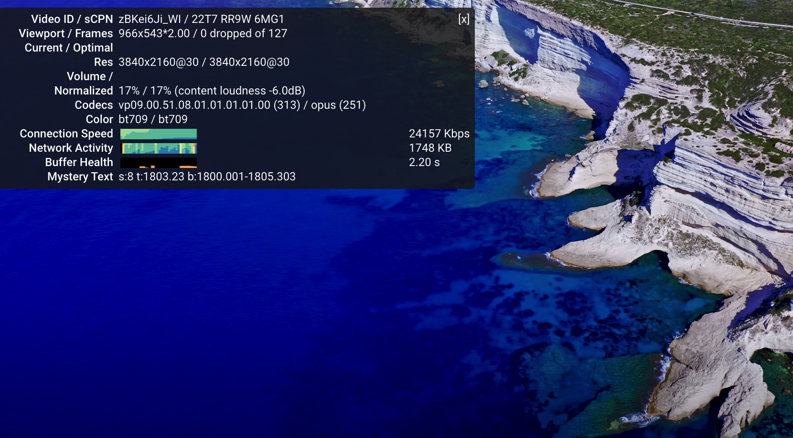

# 宝塔面板

* 一键安装

```
yum install -y wget && wget -O install.sh http://download.bt.cn/install/install_6.0.sh && sh install.sh
```


```
Bt-Panel: http://34.92.104.205:8888/1d3e3727
username: be7ntm0v
password: d0bad646
If you cannot access the panel,
release the following panel port [8888] in the security group

```
# 手动安装trojan
## 创建vps

## 检测IP

## shell远程连接vps
* 修改root访问和密码

```
输入：vi /etc/ssh/sshd_config
键盘输入 i，找到PermitRootLogin no，将no改为yes；
再找到PasswordAuthenticaion no，将no改为yes；
键盘按Esc，再输入 :wq
输入：passwd，设置密码（设置并确认）
输入：systemctl restart sshd

```
* 通过Mac终端访问Centos

```
ssh root@35.220.149.94
```

## 申请域名
### 购买域名


### 域名托管


## 解析域名
### 域名解析


### 测试IP


## 安装trojan服务端
* 一键安装trojan

```
sudo bash -c "$(curl -fsSL https://raw.githubusercontent.com/trojan-gfw/trojan-quickstart/master/trojan-quickstart.sh)"
```
* 启动trojan

```
systemctl start trojan
```
* 设置开机启动

```
systemctl enable trojan
```
* 申请SSL证书

```
# certbot 默认使用http方式对域名所有权进行验证，该操作需要绑定vps的80端口。如果80端口已被占用，请先停止占用的进程，例如停止Nginx
## 查看80端口占用
lsof -i tcp:80

## 杀死nginx进程
killall nginx

## 安装certbot
yum install -y python3 && pip3 install certbot

## 为域名申请证书
certbot certonly --standalone -d trojan.lizhangjun.xyz
```


```
# 证书申请成功报文
IMPORTANT NOTES:
 - Congratulations! Your certificate and chain have been saved at:
   /etc/letsencrypt/live/trojan.lizhangjun.xyz/fullchain.pem
   Your key file has been saved at:
   /etc/letsencrypt/live/trojan.lizhangjun.xyz/privkey.pem
   Your cert will expire on 2020-11-02. To obtain a new or tweaked
   version of this certificate in the future, simply run certbot
   again. To non-interactively renew *all* of your certificates, run
   "certbot renew"
 - If you like Certbot, please consider supporting our work by:

   Donating to ISRG / Let's Encrypt:   https://letsencrypt.org/donate
   Donating to EFF:                    https://eff.org/donate-le

 - We were unable to subscribe you the EFF mailing list because your
   e-mail address appears to be invalid. You can try again later by
   visiting https://act.eff.org.
```
* 修改trojan配置文件

```
vi /usr/local/etc/trojan/config.json
```

```
{
    "run_type": "server",
    "local_addr": "0.0.0.0",
    "local_port": 443,
    "remote_addr": "127.0.0.1",
    "remote_port": 80,
    "password": [
        "password1",//修改密码
        "password2"
    ],
    "log_level": 1,
    "ssl": {
        "cert": "/path/to/certificate.crt",//申请的证书
        "key": "/path/to/private.key",//申请的证书
        "key_password": "",
        "cipher": "ECDHE-ECDSA-AES128-GCM-SHA256:ECDHE-RSA-AES128-GCM-SHA256:ECDHE-ECDSA-AES256-GCM-SHA384:ECDHE-RSA-AES256-GCM-SHA384:ECDHE-ECDSA-CHACHA20-POLY1305:ECDHE-RSA-CHACHA20-POLY1305:DHE-RSA-AES128-GCM-SHA256:DHE-RSA-AES256-GCM-SHA384",
        "cipher_tls13": "TLS_AES_128_GCM_SHA256:TLS_CHACHA20_POLY1305_SHA256:TLS_AES_256_GCM_SHA384",
        "prefer_server_cipher": true,
        "alpn": [
            "http/1.1"
        ],
        "reuse_session": true,
        "session_ticket": false,
        "session_timeout": 600,
        "plain_http_response": "",
        "curves": "",
        "dhparam": ""
    },
    "tcp": {
        "prefer_ipv4": false,
        "no_delay": true,
        "keep_alive": true,
        "reuse_port": false,
        "fast_open": false,
        "fast_open_qlen": 20
    },
    "mysql": {
        "enabled": false,
        "server_addr": "127.0.0.1",
        "server_port": 3306,
        "database": "trojan",
        "username": "trojan",
        "password": ""
    }
}
```
* 重启trojan

```
systemctl restart trojan
```

## 安装trojan客户端
* iOS：Shadowrocket
* Mac：Trojan-Qt5
* 终端


```
# MAC终端代理设置
https://blog.csdn.net/Lengwenin/article/details/104425956
# 让终端走代理的几种方法
https://blog.fazero.me/2015/09/15/%E8%AE%A9%E7%BB%88%E7%AB%AF%E8%B5%B0%E4%BB%A3%E7%90%86%E7%9A%84%E5%87%A0%E7%A7%8D%E6%96%B9%E6%B3%95/
```
## 测试连接


## 设置BBR加速
* 一键安装脚本 

```
# 选择2选项安装，手动重启（shutdown -r now）后，7选项使用。
wget -N --no-check-certificate "https://raw.githubusercontent.com/hijkpw/Linux-NetSpeed/master/tcp.sh" && chmod +x tcp.sh && ./tcp.sh
```
## 测试速度


# 手动v2ray
## 系统

```
Debian9
```
## 安装BBR

```
## 安装wget
apt-get install wget

## 安装BBR
wget -N --no-check-certificate https://raw.githubusercontent.com/ComeBey/bbr/master/hasan.sh && chmod + hasan.sh && bash hasan.sh
```
## 安装v2ray

```
bash <(curl -L -s https://install.direct/go.sh)
```
## 安装acme.sh

```
## 安装acme.sh
curl  https://get.acme.sh | sh 
## 安装socat
apt-get install openssl cron socat curl
## 生成证书
bash ~/.acme.sh/acme.sh --issue -d 域名 --standalone -k ec-256
```
## 证书和密钥安装到指定目录

```
sudo ~/.acme.sh/acme.sh --installcert -d 域名 --fullchainpath /etc/v2ray/v2ray.crt --keypath /etc/v2ray/v2ray.key --ecc
```
## 配置文件 config.json

```
{
  "inbounds": [
    {
      "port": 443, // 服务器端口
      "protocol": "vmess",    
      "settings": {
        "clients": [
          {
            "id": "23ad6b10-8d1a-40f7-8ad0-e3e35cd38297",  
            "alterId": 64
          }
        ]
      },
      "streamSettings": {
        "network": "tcp",
        "security": "tls", // security 要设置为 tls 才会启用 TLS
        "tlsSettings": {
          "certificates": [
            {
              "certificateFile": "/etc/v2ray/v2ray.crt", // 证书文件
              "keyFile": "/etc/v2ray/v2ray.key" // 密钥文件
            }
          ]
        }
      }
    }
  ],
  "outbounds": [
    {
      "protocol": "freedom",
      "settings": {}
    }
  ]
}

```
[手动v2ray教程](https://www.rootfw.com/posts/231b7e32.html#%E7%AC%AC%E4%B8%89%E6%AD%A5-%E5%AE%89%E8%A3%85v2ray%E5%AE%98%E6%96%B9%E4%BB%A3%E7%A0%81)
[手动v2ray视频教程](https://www.youtube.com/watch?v=dt8Ngw2vz-g)
[trojan官方网站](https://github.com/trojan-gfw)
[trojan教程](https://tlanyan.me/trojan-tutorial/)
[trojan客户端1](https://tlanyan.me/trojan-clients-download/)
[trojan客户端2](https://order.yizhihongxing.network/index.php?rp=/knowledgebase/22/Windows-or-macOS-or-LinuxTrojan-QT5-%E8%AE%BE%E7%BD%AE%E6%96%B9%E6%B3%95-.html)
[获取SSL证书](https://tlanyan.me/use-lets-encrypt-certificate/)
[socketPro VPN](https://www.socketproapp.com/zh/home)
[bbr教程](https://hijk.pp.ua/install-bbr-plus-lotserver/)


